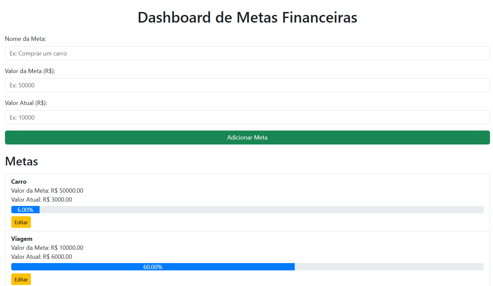

# Dashboard de Metas Financeiras

Um projeto simples e interativo para gerenciar metas financeiras, como economizar para um carro, casa, ou qualquer outro objetivo. Desenvolvido com HTML, CSS, JavaScript e Bootstrap.

 


## Funcionalidades

- **Adicionar Metas:** Insira o nome da meta, o valor total e o valor atual.
- **Barra de Progresso:** Visualize o progresso da meta com uma barra de progresso dinâmica.
- **Editar Metas:** Atualize o nome, valor total ou valor atual de uma meta existente.
- **Responsivo:** Funciona em dispositivos móveis e desktops.

## Tecnologias Utilizadas

- **HTML:** Estrutura da página.
- **CSS:** Estilização da página e barra de progresso personalizada.
- **JavaScript:** Lógica para adicionar, editar e atualizar metas.
- **Bootstrap:** Design responsivo e componentes estilizados.

## Estrutura do Projeto
```sh
metas-financeiras/
├── index.html          # Página principal
├── styles.css          # Estilos personalizados
├── script.js           # Lógica do projeto
├── README.md           # Documentação do projeto
```

## Como Usar

### 1. Clone o Repositório

```bash
git clone https://github.com/EvelineMatos/Dashboard-Metas-Financeiras
cd metas-financeiras

